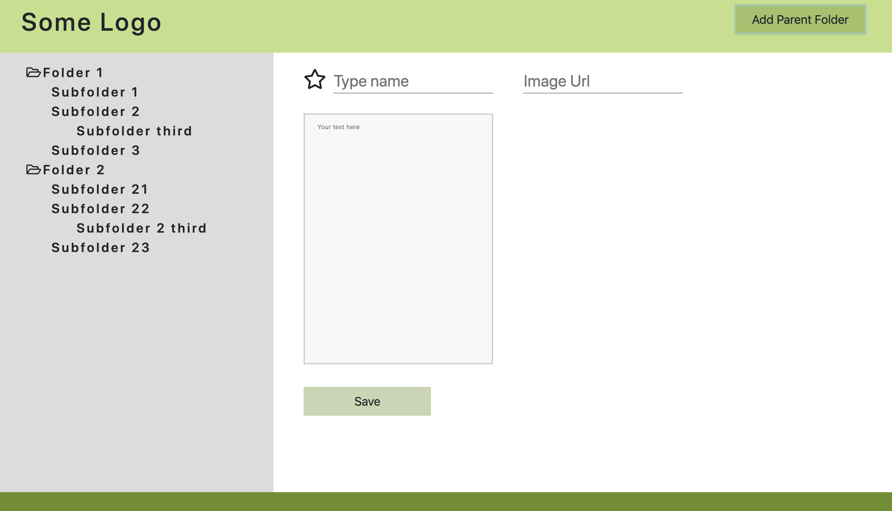
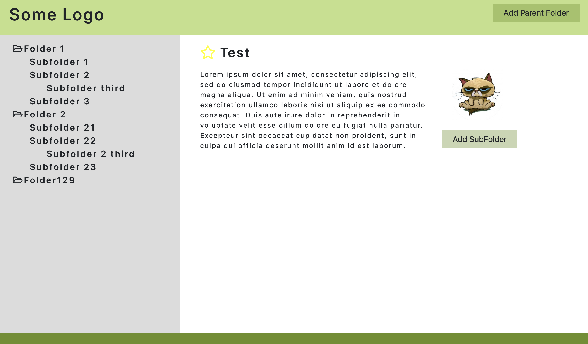
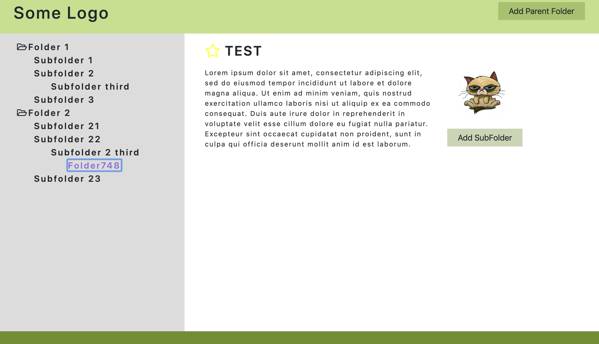

# Folders

## Description
This application demonstrates the work of Angular using internal routing. 
The first route loads the folders. The data comes in an http request. Each 
folder has subfolders in it. Some subfolders, in turn, have subfolders inside.
When you click on any folders, thanks to the route, the content of the 
selected folders is displayed. When creating a new folder, the validity of all 
fields is checked for completion and in accordance with other rules established 
by the component. The number of the new folder is generated by the random number 
function. When you click on the save button, the new folder is saved in the folder
tree. If this is the main folder, saving will occur in the list of "folders".
If the subfolder then the new subfolder will take its place under the parent folder.
The route is updated after each addition and we see the contents of the created folder. 
This folder addition is implemented by a recursive function. A service is involved in 
the work which describes - receiving data from the request api, searching for folders 
and adding folders. To style the application scss is used. The following libraries 
were also used: Angular 8.3.0, RxJS 6.4.0, Bootstrap 4.3.1.

This project was generated with [Angular CLI](https://github.com/angular/angular-cli) version 8.3.0.

## Development server

Run `ng serve` for a dev server. Navigate to `http://localhost:4200/`. The app will automatically reload if you change any of the source files.

## Code scaffolding

Run `ng generate component component-name` to generate a new component. You can also use `ng generate directive|pipe|service|class|guard|interface|enum|module`.

## Build

Run `ng build` to build the project. The build artifacts will be stored in the `dist/` directory. Use the `--prod` flag for a production build.

## Running unit tests

Run `ng test` to execute the unit tests via [Karma](https://karma-runner.github.io).

## Running end-to-end tests

Run `ng e2e` to execute the end-to-end tests via [Protractor](http://www.protractortest.org/).

## Further help

To get more help on the Angular CLI use `ng help` or go check out the [Angular CLI README](https://github.com/angular/angular-cli/blob/master/README.md).
